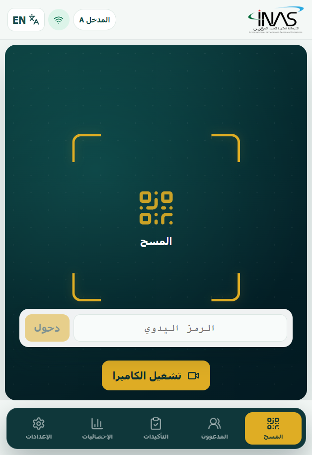
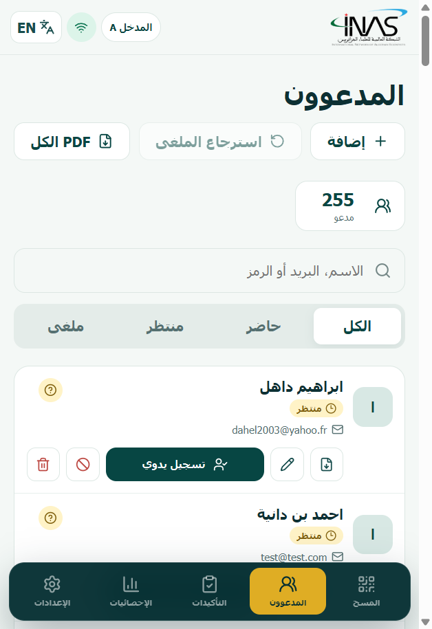
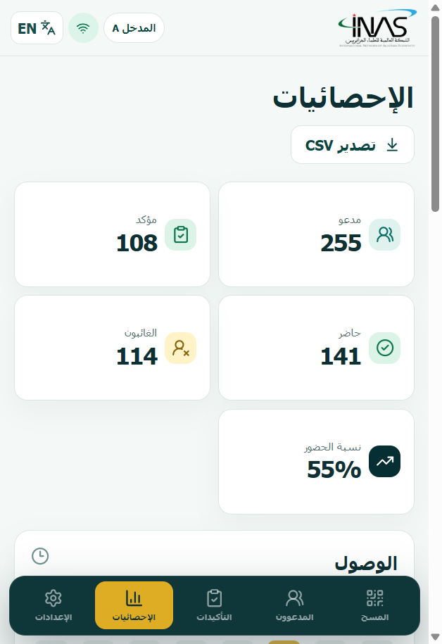
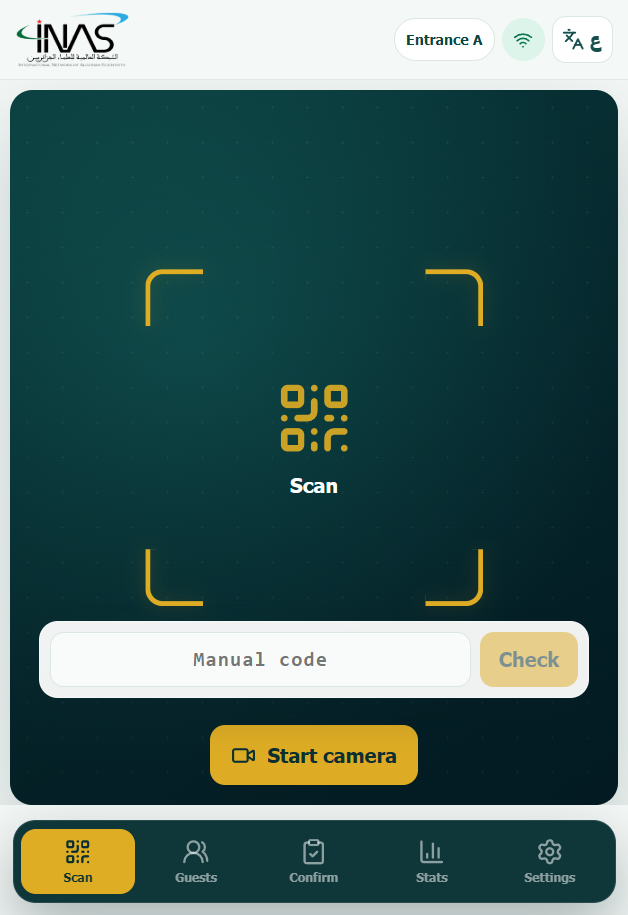
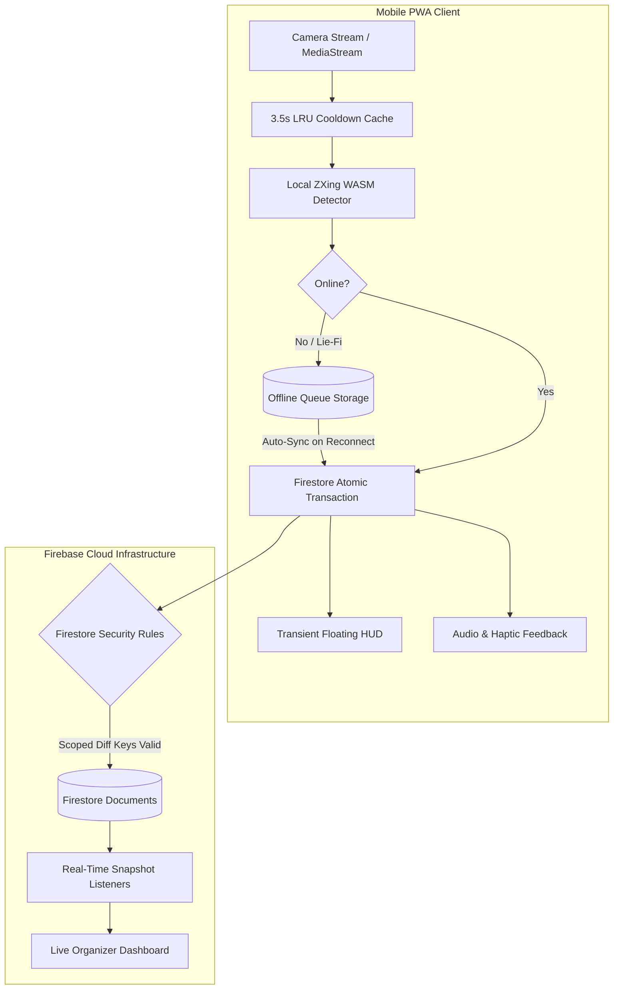

# GateFlow — Ultra-Fast, Offline-First QR Event Check-in PWA

<p align="center">
  <strong>Production-grade, offline-resilient event gate management and QR check-in application built with React, Vite, TypeScript, and Firebase.</strong>
</p>

<p align="center">
  
  
  
  
  
  
</p>

---

## 📱 Mobile Visual Showcase

<p align="center">
  
  &nbsp;
  
  &nbsp;
  
  &nbsp;
  
</p>

<p align="center">
  <em>(Screenshots captured directly from the live PWA running on mobile viewport)</em>
</p>

---

## ⚡ Core Features & Engineering Highlights

### 🚀 Continuous HUD Camera Scanning (< 0.8s Cycle Time)
- **Zero Hardware Teardown**: Unlike conventional check-in apps that shut down the camera sensor after each scan, the camera stream remains continuously active.
- **Transient Status Card**: Verification feedback (green valid, gold duplicate, red invalid) displays via a lightweight HUD card with a 2.6s auto-dismiss. Staff can scan hundreds of attendees consecutively without touching the device screen.
- **In-Memory Cooldown Cache**: An LRU debounce filter blocks multi-frame duplicate reads of the same ticket within 3.5 seconds, eliminating false "Already Checked In" race conditions.

### 📶 Offline-First Resiliency & WASM Barcode Detection
- **Self-Contained Offline WebAssembly**: Pre-caches `zxing_reader.wasm` directly within the Service Worker Cache Storage (`workbox-precache-v2`). iOS Safari and Android browsers decode QR codes completely offline without relying on external CDN fallbacks.
- **Deadlock-Free Offline Queue**: Scans recorded during network dropouts or "Lie-Fi" conditions (where cellular data connects but drops packets) are safely queued in local storage and synchronized sequentially upon reconnect.
- **Poison-Pill Quarantine**: Corrupted or permanently failing items are automatically moved to a local Dead Letter Queue after 3 attempts, guaranteeing the sync queue never freezes.
- **Offline Duplicate Conflict Alerts**: If an attendee is admitted offline at Gate A while simultaneously checked in at Gate B, the sync engine alerts gate staff immediately upon reconnection.

### 🔦 Mobile Hardware Integration
- **Screen Wake Lock API**: Automatically requests `navigator.wakeLock` to prevent phone displays from dimming or locking during gate shifts.
- **Native Torch / Flashlight Control**: Directly controls device flash hardware via `MediaStreamTrack.applyConstraints({ advanced: [{ torch }] })` for low-light venue entrances.
- **Lifecycle Auto-Resume**: Seamlessly pauses camera streaming when an incoming call or tab switch occurs, and automatically resumes when the app returns to the foreground.
- **Audio & Haptic Feedback**: Delivers distinct affirmative and negative audio tones via a shared Web Audio oscillator, supplemented by vibration patterns on supported devices.

### 🛡️ Enterprise Security & Concurrency Invariants
- **Cryptographic Ticket Privacy**: Badges encode only `INAS1.<eventId>.<random-256bit-token>`. Attendee names, emails, and phone numbers are never stored in QR codes.
- **Optimistic Concurrency Control**: All check-in operations run as atomic Firestore transactions (`runTransaction`), strictly serializing concurrent scans across multiple entrances down to the millisecond.
- **Scoped Diff Keys in Security Rules**: Firestore security rules restrict update payloads by operation type: check-in transactions can only touch check-in timestamp and station identity fields, preventing attendee profile tampering.

### 🌍 First-Class Bilingual Arabic (RTL) & English (LTR)
- **Native Right-to-Left Layout**: Built from the ground up for Arabic-speaking conferences and venues with full RTL flex/grid alignment and typography.
- **Instant Language Toggle**: One-tap toggle instantly switches the entire interface to English (LTR) for international staff and attendees.

---

## 🏗️ Architecture & Data Flow



---

## 📂 Project Organization

```text
├── public/                     # Static assets, icons, PWA manifest, and ZXing WASM
│   ├── inas-icon-192.png       # PWA app icons (192x192, 512x512)
│   ├── inas-logo.png           # High-resolution vector branding
│   └── zxing_reader.wasm       # Offline-first BarcodeDetector WASM binary (1.09 MB)
├── src/
│   ├── assets/                 # Embedded SVG graphics and logos
│   ├── components/             # Reusable UI components (AppShell, LoginScreen, BrandLogo)
│   ├── data/                   # Demo datasets, schedules, and test tickets
│   ├── lib/
│   │   ├── api.ts              # Firebase client SDK, transactions, and session engine
│   │   ├── domain.ts           # Business logic, Arabic normalization, statistics calculation
│   │   ├── firebase.ts         # Firebase initialization with multi-tab IndexedDB cache
│   │   ├── i18n.ts             # Bilingual Arabic / English copy dictionaries
│   │   ├── invitationPdf.ts    # Secure client-side ticket PDF rendering engine
│   │   ├── offlineQueue.ts     # Resilient, deadlock-free offline sync queue
│   │   └── scanner.ts          # Camera hardware lifecycle, native torch & wake lock
│   ├── screens/                # Core screens
│   │   ├── ScanScreen.tsx      # Continuous HUD camera scanner & manual code entry
│   │   ├── PeopleScreen.tsx    # Paginated attendee directory & instant search
│   │   ├── ConfirmationsScreen.tsx # RSVP status tracking & confirmation notes
│   │   ├── DashboardScreen.tsx # Real-time analytics, arrival charts & station metrics
│   │   └── SettingsScreen.tsx  # Entrance switching, dark/light, station logout
│   ├── styles.css              # Custom responsive stylesheet (RTL & LTR)
│   ├── App.tsx                 # Root application shell & routing
│   └── main.tsx                # Entry point, Service Worker registration & persistence
├── functions/                  # Cloud Functions (Backend verification & admin tools)
├── email-automation/           # (Optional) Google Apps Script batch email invitation console
├── docs/screenshots/           # Mobile viewport screenshot showcase
├── firebase.json               # Firebase Hosting headers (CSP, HSTS, WASM caching)
├── firestore.rules             # Production security rules with scoped diff key validation
└── vite.config.ts              # Vite PWA configuration with Workbox precache rules
```

---

## 🚀 Getting Started

### Prerequisites
- Node.js 20+
- npm or pnpm
- A Firebase project (with Firestore, Authentication, and Hosting enabled)

### 1. Installation
Clone the repository and install dependencies:

```bash
git clone https://github.com/your-username/fastgate-pwa.git
cd fastgate-pwa
npm install
```

### 2. Environment Configuration
Copy the example environment file:

```bash
cp .env.example .env.local
```

Fill in your Firebase credentials in `.env.local`:
```env
VITE_FIREBASE_API_KEY=your_api_key
VITE_FIREBASE_AUTH_DOMAIN=your_project.firebaseapp.com
VITE_FIREBASE_PROJECT_ID=your_project_id
VITE_FIREBASE_STORAGE_BUCKET=your_project.firebasestorage.app
VITE_FIREBASE_MESSAGING_SENDER_ID=your_sender_id
VITE_FIREBASE_APP_ID=your_app_id
VITE_EVENT_ID=your-event-2026
VITE_ENTRANCE_A_EMAIL=station-a@your-domain.org
VITE_ENTRANCE_B_EMAIL=station-b@your-domain.org
```

> **Note**: Without Firebase credentials configured, the app runs in an interactive **Offline Demo Mode** with mock attendees, allowing full UI and feature testing out of the box.

### 3. Run Development Server
```bash
npm run dev
```
Open your browser at `http://localhost:5173`.

### 4. Run Automated Tests
```bash
npm test
```
Executes the Vitest test suite covering domain normalization, statistics calculation, and attendance invariants.

### 5. Build for Production
```bash
npm run build
```
Compiles TypeScript, bundles code into optimized chunks (`scanner`, `firebase`, `icons`, `ui`), and generates the Workbox Service Worker precaching the WASM reader.

---

## 🌐 Production Deployment

Deploy to Firebase with a single command:

```bash
firebase deploy --only hosting,firestore:rules
```

The configuration in `firebase.json` automatically establishes:
- **Strict Security Headers**: Content Security Policy (CSP), `X-Frame-Options: DENY`, `X-Content-Type-Options: nosniff`.
- **WASM Acceleration**: 1-year immutable caching headers (`Cache-Control: public,max-age=31536000,immutable`) on `/*.wasm`.
- **Permissions Policy**: Camera hardware access scoped strictly to the application origin.

---

## ✉️ Email Automation Pipeline (`email-automation/`)

For pre-event badge distribution, a separate Google Apps Script automation suite is included in [`email-automation/`](email-automation/):
- Sends personalized digital invitations with embedded QR codes in safe, resumable batches (up to 25 emails per batch).
- Integrates a **bot-safe confirmation web app** (`Confirm.gs`) that protects against automated enterprise email spam scanners accidentally confirming attendance.
- All template configurations and environment values are sanitized and ready for private Google Cloud project linkage.

---

## 🏛️ About The Event

**FastGate** was originally engineered as the official check-in and gate management system for the **INAS National Quality Forum 2026** (*الملتقى الوطني لضمان الجودة*), organized by the **International Network of Algerian Scientists and Experts (INAS)**. 

Held at **HIS University in Algiers**, the event brought together university rectors, professors, quality assurance directors, and international researchers to evaluate ISO 9001:2015 implementation across higher education and research institutions. The software processed attendee registrations seamlessly across multiple simultaneous venue entrances with zero downtime.
